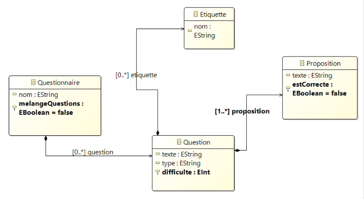
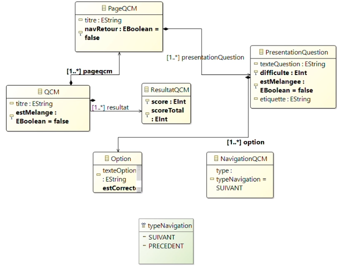

# QCM Website Generator
> This is a Java project that uses various MDE (Model-Driven Engineering) tools to automate the generation of a QCM (multiple-choice questionnaire) website based on a very simplified human language.

## The Used Tools
1. Eclipse Ecore
2. Acceleo
3. Xtext
4. QVT

## How It Works
The transformation follows four steps:
1. **Creation of Two Metamodels** : Using Ecore, we define two metamodels: The QCM metamodel (defines what a QCM is), The QCMPresentation metamodel (defines the structure of the web page). (see the two projects named `Metamodele 1 - Questionnaire` and `Metamodele 2 - Presentation`)

    

    

2. **DSL Definition and QCM Instance Creation With Xtext** : we define a DSL (Domain Specific Language) tailored for QCMs. We then use this DSL to write a QCM (for example, instance.qcm) as an instance of the first metamodel. (see the project named Xtext)
4. **Model-to-Model (M2M) Transformation** : QVT is used to transform the QCM model into the QCMPresentation model, mapping the questionnaire structure to a web presentation structure. (see the project named M2M)
5. **Code Generation** : Acceleo is used to generate the HTML and JavaScript code from the QCMPresentation model, automating the creation of the QCM website. (see the project named M2T)
